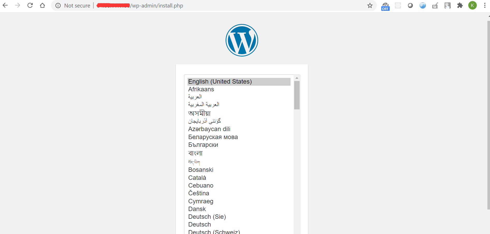
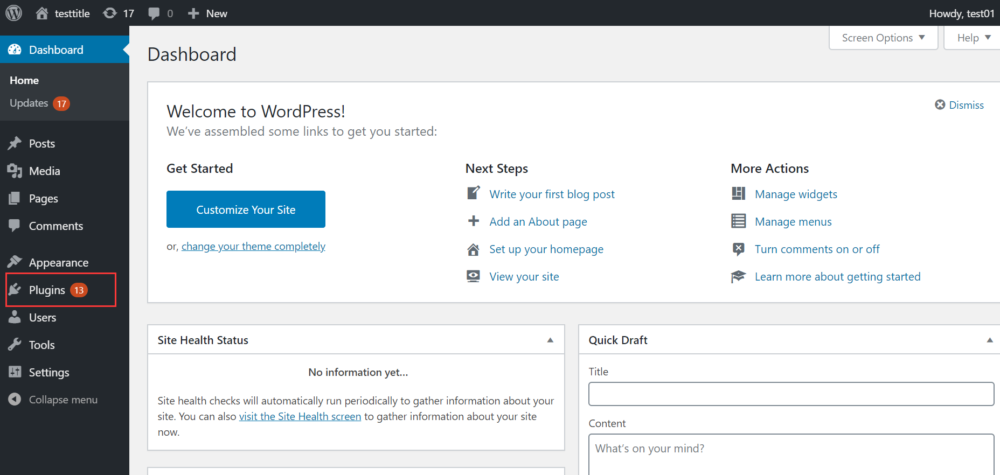
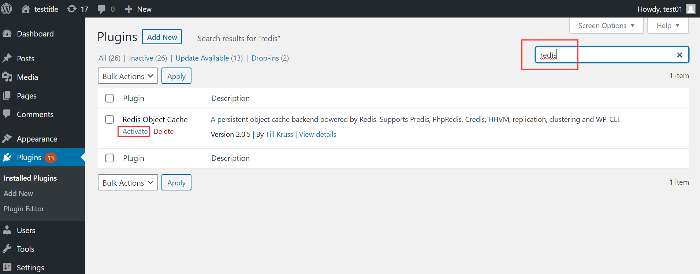
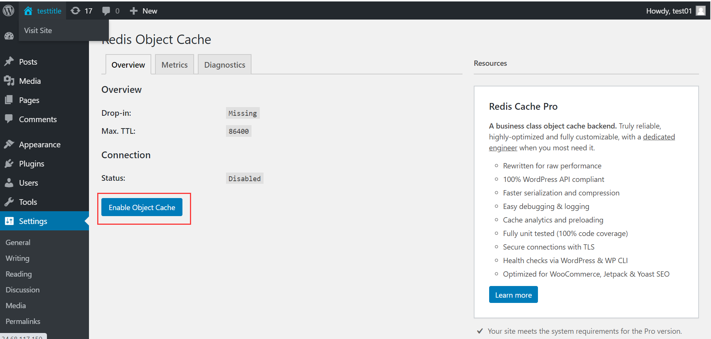
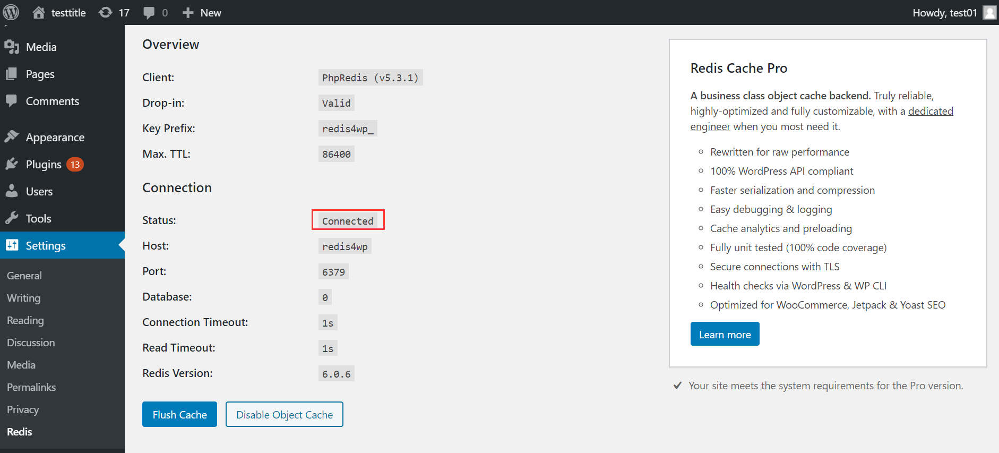

# kubernete_wordpress_postgresql
This is a demo to build a [wordpress](https://wordpress.org/) based on [Postgresql](https://www.postgresql.org/) and use [redis](https://redis.io/) as cache to boost website access which based on the [kubernete](https://kubernetes.io/).

## Directory Descritption
### image: This is the building process about wordpress running based on the postgresql.  
### k8s_yaml: kubernete yaml files
### tools: This project dosn't depend on this directory. They are what I script tools help me to debug when I built this project.

## Building instruction
Use restart.sh script, this script would stop first, then start, so when the first time to run it, some error would be happened and can be ignored.
```
# cd k8s_yaml && sh restart.sh
Error from server (NotFound): error when deleting "./": secrets "postgresql-pass-m8tmhg2fg9" not found
Error from server (NotFound): error when deleting "./": services "wordpress-postgresql" not found
Error from server (NotFound): error when deleting "./": services "wordpress" not found
Error from server (NotFound): error when deleting "./": deployments.apps "wordpress-postgresql" not found
Error from server (NotFound): error when deleting "./": deployments.apps "wordpress" not found
Error from server (NotFound): error when deleting "./": persistentvolumeclaims "postgresql-pv-claim" not found
Error from server (NotFound): error when deleting "./": persistentvolumeclaims "wp-pv-claim" not found
Error from server (NotFound): error when deleting "pv/local-pv01.yaml": persistentvolumes "local-pv01" not found
Error from server (NotFound): error when deleting "pv/local-pv02.yaml": persistentvolumes "local-pv02" not found
Error from server (NotFound): error when deleting "redis/redis.yaml": services "redis4wp" not found
Error from server (NotFound): error when deleting "redis/redis.yaml": deployments.apps "redis4wp" not found
persistentvolume/local-pv01 created
persistentvolume/local-pv02 created
secret/postgresql-pass-m8tmhg2fg9 created
service/wordpress-postgresql created
service/wordpress created
deployment.apps/wordpress-postgresql created
deployment.apps/wordpress created
persistentvolumeclaim/postgresql-pv-claim created
persistentvolumeclaim/wp-pv-claim created
service/redis4wp created
deployment.apps/redis4wp created
```
Then list the pods, deployment and service to confirm all of the component started up.
```
# kubectl get pods
NAME                                   READY   STATUS    RESTARTS   AGE
dnsutils                               1/1     Running   103        5d14h
redis4wp-8698df44b6-f6m9s              1/1     Running   0          2m9s
wordpress-7467bc8b64-494fv             1/1     Running   0          2m9s
wordpress-postgresql-75997b8cd-qkprm   1/1     Running   0          2m9s

# kubectl get deployment
NAME                   READY   UP-TO-DATE   AVAILABLE   AGE
redis4wp               1/1     1            1           4m2s
wordpress              1/1     1            1           4m2s
wordpress-postgresql   1/1     1            1           4m2s

# kubectl get service
NAME                   TYPE           CLUSTER-IP     EXTERNAL-IP   PORT(S)        AGE
kubernetes             ClusterIP      10.96.0.1      <none>        443/TCP        34d
redis4wp               ClusterIP      10.98.57.190   <none>        6379/TCP       4m38s
wordpress              LoadBalancer   10.109.192.3   <pending>     80:32028/TCP   4m38s
wordpress-postgresql   ClusterIP      None           <none>        5432/TCP       4m38s
```
Use port-forward to export the wordpress service port to see the page:
```
# kubectl port-forward wordpress-7467bc8b64-494fv 80:80 --address 0.0.0.0
Forwarding from 0.0.0.0:80 -> 80
```
Then put the public ip of your host, you can see the wordpress page:


## Open Redis plugin
After create account as the instruction, we can login to wordpress and in the dashboard page click 'plugin':

In the plugin page, put 'redis' to top right's search tool and enter, we can see the 'redis object cache' plugin and under this, click the 'Activate':

Then the Activate turn to Settings, click it and it would display the redis plugin configuration interface, click the 'Enable Object cache':

If you see the 'Connected' status in the page, it means redis cache is working now:



